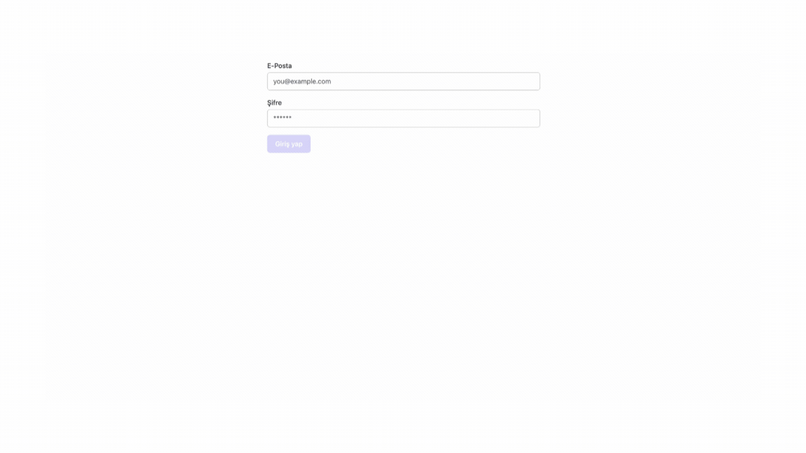

# Firebase Aut

Bu proje, React ve Firebase kullanarak kullanıcı kimlik doğrulama işlemlerini gerçekleştiren bir web uygulamasıdır.

## Kullanılan Teknolojiler ve Kütüphaneler
### Ana Kütüphaneler
- React: Kullanıcı arayüzleri oluşturmak için kullanılan popüler bir JavaScript kütüphanesi. (react: ^18.3.1, react-dom: ^18.3.1)
- React Router DOM: React uygulamalarında yönlendirme işlemlerini yönetmek için kullanılır. (react-router-dom: ^6.25.1
- Redux Toolkit: Durum yönetimini kolaylaştırmak için kullanılan bir araç seti. (@reduxjs/toolkit: ^2.2.6)
React Redux: React ile Redux'u bağlamak için kullanılır. (react-redux: ^9.1.2)
- Firebase: Google tarafından sağlanan bir platform olup kimlik doğrulama, veritabanı, depolama ve daha fazlasını içerir. Bu projede Firebase Authentication kullanılmaktadır. (firebase: ^10.12.3)
- React Hot Toast: Kullanıcı bildirimlerini göstermek için kullanılan bir kütüphane. (react-hot-toast: ^2.4.1)

# Firebase-Aut
